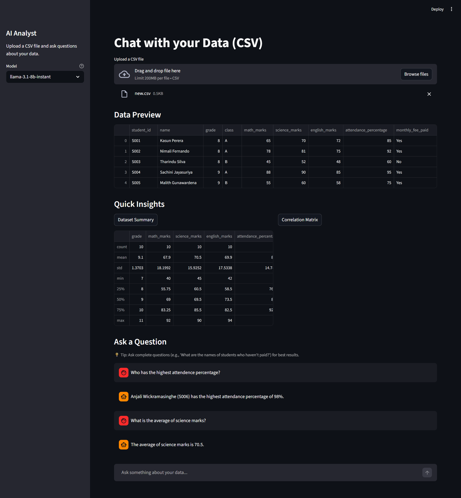
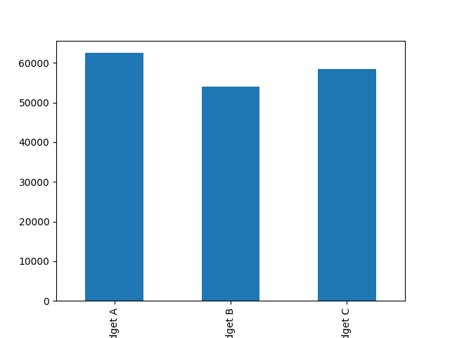

# AI Data Analyst

An intelligent data analysis tool built with Streamlit, LangChain, and Groq. Upload a CSV file and chat with your data using natural language queries powered by AI.

 


## Features

- **CSV Upload & Preview**: Easily upload and preview your data
- **Quick Insights**: Instant dataset summary and correlation matrix
- **Conversational AI**: Chat with your data using natural language
- **Multiple Models**: Switch between Groq models (llama-3.3-70b-versatile, llama-3.1-8b-instant, etc.)
- **Caching**: Optimized performance with smart caching
- **Secure**: API keys stored locally in `.env`

## Prerequisites

- Python 3.8+
- Groq API key (get one at [console.groq.com](https://console.groq.com))

## Installation

1. **Clone the repository**:
   ```bash
   git clone https://github.com/Diluksha-Upeka/ai-analyst.git
   cd ai-analyst
   ```

2. **Create virtual environment**:
   ```bash
   python -m venv .venv
   ```

3. **Activate virtual environment**:
   - Windows: `.venv\Scripts\activate`
   - macOS/Linux: `source .venv/bin/activate`

4. **Install dependencies**:
   ```bash
   pip install -r requirements.txt
   ```

5. **Set up environment variables**:
   Create a `.env` file in the root directory:
   ```
   GROQ_API_KEY=your_groq_api_key_here
   ```

## Usage

1. **Run the application**:
   ```bash
   streamlit run app.py
   ```

2. **Open your browser** to `http://localhost:8501`

3. **Upload a CSV file** and start asking questions!

### Example Questions

- "What are the top 5 highest-performing students?"
- "Show me the correlation between sales and profit"
- "Who are the customers with orders over $1000?"
- "Generate a summary report of the dataset"

## Configuration

### Model Selection

Choose from available Groq models in the sidebar:
- `llama-3.3-70b-versatile`: Most capable, slower
- `llama-3.1-8b-instant`: Fast, good for simple queries
- `gemma2-9b-it`: Balanced performance
- `mixtral-8x7b-32768`: Good for complex reasoning

### API Key

If you don't have a `.env` file, you can enter your Groq API key directly in the sidebar.

## Project Structure

```
ai-data-analyst/
├── app.py                 # Main Streamlit application
├── requirements.txt       # Python dependencies
├── .env                   # Environment variables (not committed)
├── .gitignore            # Git ignore rules
├── README.md             # This file
└── data.csv              # Sample data file
```

## Troubleshooting

### Common Issues

1. **Module not found errors**:
   - Ensure you're using the virtual environment
   - Run `pip install -r requirements.txt`

2. **Rate limit exceeded**:
   - Switch to a smaller model (e.g., llama-3.1-8b-instant)
   - Upgrade your Groq plan for higher limits

3. **Agent stops due to iteration limit**:
   - Ask simpler, more specific questions
   - The limit is set to 15 iterations for complex queries

### Performance Tips

- Use smaller models for faster responses
- Cache is enabled for DataFrames and agents
- Ask one question at a time for best results

## Contributing

1. Fork the repository
2. Create a feature branch: `git checkout -b feature-name`
3. Make your changes and test thoroughly
4. Commit your changes: `git commit -m 'Add some feature'`
5. Push to the branch: `git push origin feature-name`
6. Submit a pull request


## Acknowledgments

- [Streamlit](https://streamlit.io/) for the web framework
- [LangChain](https://langchain.com/) for the AI orchestration
- [Groq](https://groq.com/) for fast LLM inference
- [Pandas](https://pandas.pydata.org/) for data manipulation


