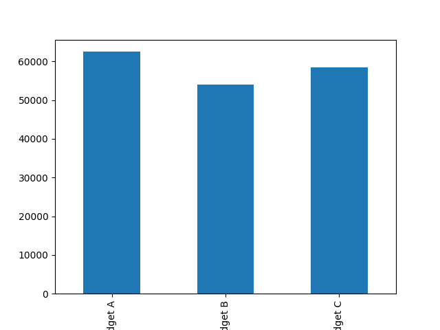

# AI Data Analyst

An intelligent data analysis tool built with Streamlit, LangChain, and Groq. Upload a CSV file and chat with your data using natural language queries powered by AI.

 


## Features

- **CSV Upload & Preview**: Easily upload and preview your data
- **Data Health Check**: See health score, missing values, duplicates, type issues, and outliers before AI analysis
- **Root Cause Explorer**: Compare two periods and identify which categories drove metric changes
- **What-If Simulator**: Apply scenario changes to numeric drivers and estimate KPI impact
- **Analysis Journal**: Save snapshots of analyses and export reproducibility logs as JSON/CSV
- **Demo Assistant**: Feature readiness checklist, one-click sample dataset download, and AI prompt templates
- **Quick Insights**: Instant dataset summary and correlation matrix
- **Chart Generation**: Automatically generate visualizations and plots for your data
- **Conversational AI**: Chat with your data using natural language
- **Multiple Models**: Switch between Groq models (llama-3.3-70b-versatile, llama-3.1-8b-instant, etc.)
- **Caching**: Optimized performance with smart caching
- **Secure**: API keys stored locally in `.env`

## Prerequisites

- Python 3.8+
- Groq API key (get one at [console.groq.com](https://console.groq.com))

## Installation

1. **Clone the repository**:
   ```bash
   git clone https://github.com/Diluksha-Upeka/ai-analyst.git
   cd ai-analyst
   ```

2. **Create virtual environment**:
   ```bash
   python -m venv .venv
   ```

3. **Activate virtual environment**:
   - Windows PowerShell: `. .\\.venv\\Scripts\\Activate.ps1`
   - Windows CMD: `.venv\\Scripts\\activate.bat`
   - macOS/Linux: `source .venv/bin/activate`

4. **Install dependencies**:
   ```bash
   pip install -r requirements.txt
   ```

5. **Set up environment variables**:
   Create a `.env` file in the root directory:
   ```
   GROQ_API_KEY=your_groq_api_key_here
   ```

## Usage

1. **Run the application**:
   ```bash
   .\\.venv\\Scripts\\python.exe -m streamlit run app.py
   ```

2. **Open your browser** to `http://localhost:8501`

3. **Upload a CSV file** and start asking questions!
   - Or click **Load Sample Showcase Dataset** to run the full demo immediately.

For a fast showcase flow, upload `sample_showcase_data.csv` included in this repo.

You can run Data Health Check without an API key. Add your Groq API key only when you want AI chat analysis.

Root Cause Explorer works best when your CSV includes a date column and at least one categorical column.

What-If Simulator needs at least two numeric columns (one target metric and one or more driver columns).

Analysis Journal records Data Health, Root Cause, What-If, and AI chat outputs so you can showcase a reproducible analysis trail.

Demo Assistant gives you a quick readiness table for each feature and lets you load prompt templates into the AI question box.

## Interview Demo Flow (5-7 Minutes)

1. Upload `sample_showcase_data.csv`.
2. Open **Demo Assistant** and confirm readiness is `Yes` for Root Cause and What-If.
3. Show **Data Health Check**:
   - Highlight missing values, duplicate rows, and outliers.
   - Save a snapshot to Analysis Journal.
4. Show **Root Cause Explorer**:
   - Metric: `revenue`
   - Dimension: `product_category` or `region`
   - Compare latest two monthly periods.
   - Save snapshot.
5. Show **What-If Simulator**:
   - Target metric: `revenue`
   - Drivers: `discount_pct`, `marketing_spend`
   - Apply +/- changes and run scenario.
   - Save snapshot.
6. Use a **Demo Assistant prompt template** in AI Chat and run one chart question.
7. Export **Analysis Journal** as JSON/CSV to show reproducibility.

### Example Questions

- "What are the top 5 highest-performing students?"
- "Show me the correlation between sales and profit"
- "Who are the customers with orders over $1000?"
- "Generate a bar chart of sales by region"
- "Generate a summary report of the dataset"

## Configuration

### Model Selection

Choose from available Groq models in the sidebar:
- `llama-3.3-70b-versatile`: Most capable, slower
- `llama-3.1-8b-instant`: Fast, good for simple queries
- `gemma2-9b-it`: Balanced performance
- `mixtral-8x7b-32768`: Good for complex reasoning

### API Key

If you don't have a `.env` file, you can enter your Groq API key directly in the sidebar.

## Project Structure

```
ai-data-analyst/
├── app.py                  # Main Streamlit application (UI orchestration)
├── analytics/              # Core analytics modules
│   ├── __init__.py
│   ├── data_health.py      # Data health scoring logic
│   ├── root_cause.py       # Root cause period comparison logic
│   └── what_if.py          # Scenario simulation logic
├── requirements.txt        # Python dependencies
├── .env                    # Environment variables (not committed)
├── .gitignore              # Git ignore rules
├── README.md               # This file
└── data.csv                # Sample data file
└── sample_showcase_data.csv # Interview demo dataset with built-in anomalies
```

## Troubleshooting

### Common Issues

1. **Module not found errors**:
   - Ensure you're using the virtual environment
   - Run `pip install -r requirements.txt`

2. **ImportError: cannot import name 'ModelProfile'**:
   - This means Streamlit is running from a different Python install than your project `.venv`
   - Use: `.\\.venv\\Scripts\\python.exe -m streamlit run app.py`
   - Confirm with PowerShell: `Get-Command streamlit`

3. **Rate limit exceeded**:
   - Switch to a smaller model (e.g., llama-3.1-8b-instant)
   - Upgrade your Groq plan for higher limits

4. **Agent stops due to iteration limit**:
   - Ask simpler, more specific questions
   - The limit is set to 15 iterations for complex queries

### Performance Tips

- Use smaller models for faster responses
- Cache is enabled for DataFrames and agents
- Ask one question at a time for best results

## Contributing

1. Fork the repository
2. Create a feature branch: `git checkout -b feature-name`
3. Make your changes and test thoroughly
4. Commit your changes: `git commit -m 'Add some feature'`
5. Push to the branch: `git push origin feature-name`
6. Submit a pull request


## Acknowledgments

- [Streamlit](https://streamlit.io/) for the web framework
- [LangChain](https://langchain.com/) for the AI orchestration
- [Groq](https://groq.com/) for fast LLM inference
- [Pandas](https://pandas.pydata.org/) for data manipulation


